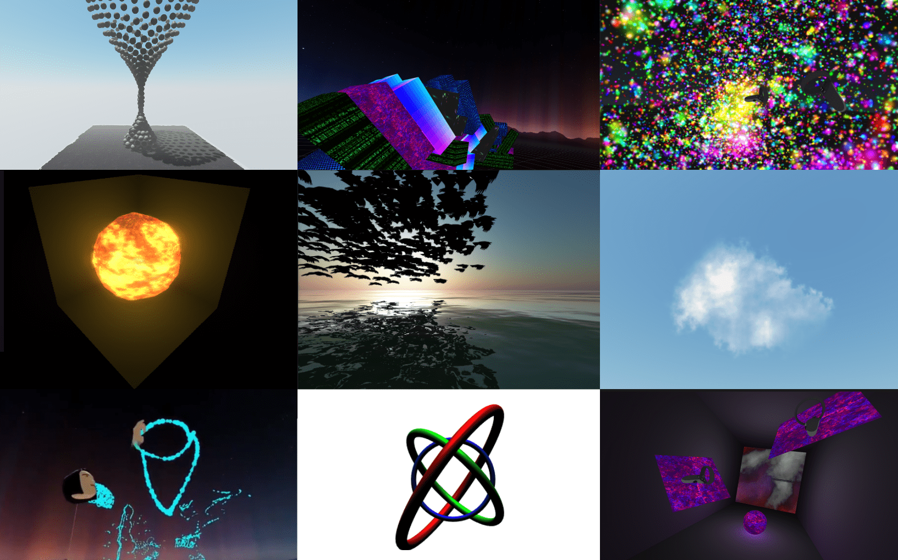

# Sandcastle

## A friendly WebXR prototyping engine

### Features

- Built on vanilla [threeJS](http://threejs.org/)

- Made for WebXR ("out-of-the-box" XR [session&state management](https://github.com/plutovr/sandcastle/wiki#webxr-general) & easy [input event handling](https://github.com/plutovr/sandcastle/wiki#webxr-input))

- Built-in [Physics & Collision Detection](https://github.com/plutovr/sandcastle/wiki#physics) courtesy of [CannonJS](http://www.cannonjs.org/)

- Easy and Simple [WebRTC-based networking & media streaming](https://github.com/plutovr/sandcastle/wiki#networking) courtesy of [ThreeNetwork](https://github.com/takahirox/ThreeNetwork)

- Tiny project build sizes (~250kb gzipped before assets, just a bit more than the logo image above!)

### Usage

Run `npm init sandcastle NAMEOFPROJECT` _OR_ `npx create-sandcastle NAMEOFPROJECT`, where NAMEOFPROJECT is your desired project name. 
This will:
1. clone this repo into a new folder of that name
2. install Sandcastle's dependencies
3. remove the `.git` repo
4. launch the dev server and
5. open the default scene (located at `./src/examples/defaultScene.js`) in your browser.

#### Other useful commands:

- `npm start` from the project folder to launch the dev server (the initializer does this).

- `npm build` will process and build your project into the `dist` folder.

Check out the [Wiki](https://github.com/plutovr/sandcastle/wiki) for a closer look at Sandcastle's Networking API, Physics API, event handling and state management, asset pipelines and more.

#### _This project is in pre-alpha and currently undergoes daily work. Is something broken or unclear? Please file an issue!_
